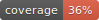

# Spelling Bee Answers &middot;  

**An automated archive of [NYTimes Spelling Bee][1] puzzle answers**

New puzzles are released at [3 am ET](https://time.is/ET).

## Puzzles

See [Days.md](outputs/Days.md).

## Pangrams

See [Pangrams.md](outputs/Pangrams.md).

## Words

See [Words.md](outputs/Words.md).

[1]: https://www.nytimes.com/puzzles/spelling-bee
